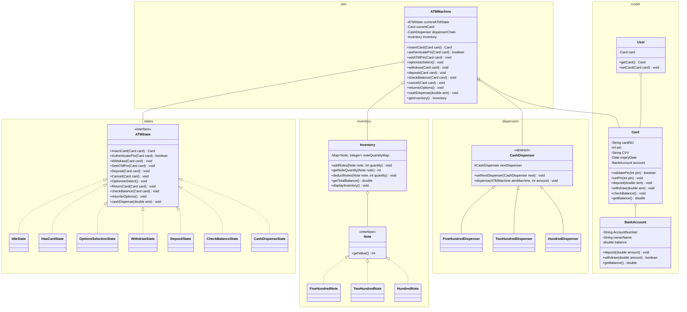
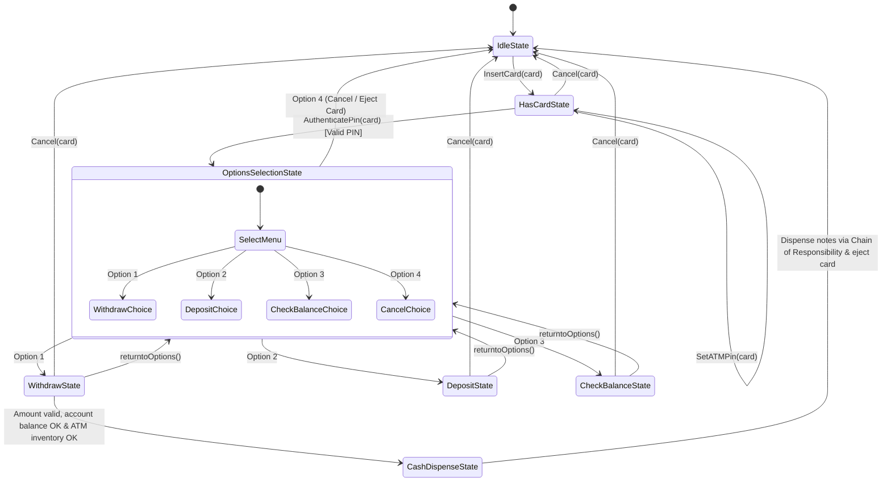
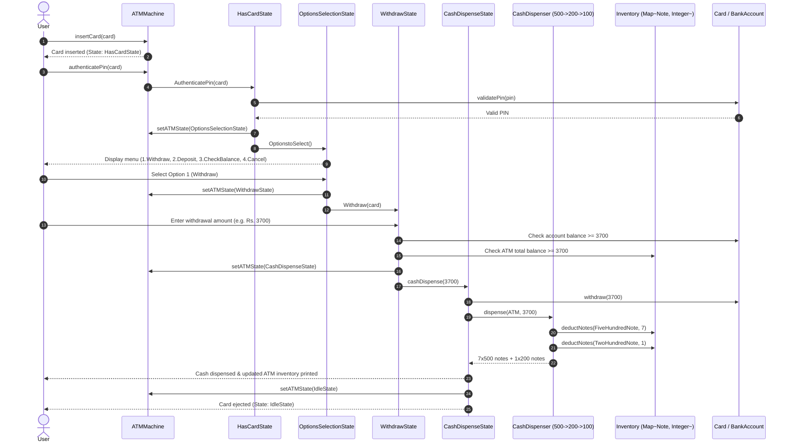

# ATM Machine System - Low-Level Design (LLD)

A robust, object-oriented Low-Level Design of an ATM Machine system implemented in Java.

---

## 📁 Clean Modular Architecture

```text
ATMMachineC/
├── states/                      # State Pattern Implementation
│   ├── ATMState.java
│   ├── IdleState.java
│   ├── HasCardState.java
│   ├── OptionsSelectionState.java
│   ├── WithdrawState.java
│   ├── DepositState.java
│   ├── CheckBalanceState.java
│   └── CashDispenseState.java
├── dispensers/                  # Chain of Responsibility Note Dispensers
│   ├── CashDispenser.java
│   ├── FiveHundredDispenser.java
│   ├── TwoHundredDispenser.java
│   └── HundredDispenser.java
├── inventory/                   # Note Hierarchy & Inventory Management
│   ├── Note.java                # Note Interface
│   ├── FiveHundredNote.java     # 500 Denomination Note
│   ├── TwoHundredNote.java      # 200 Denomination Note
│   ├── HundredNote.java         # 100 Denomination Note
│   └── Inventory.java           # Manages Map<Note, Integer>
├── model/                       # Domain Models
│   ├── BankAccount.java
│   ├── Card.java
│   └── User.java
├── atm/                         # ATM Context
│   └── ATMMachine.java
├── Main.java                    # Entry Point & Test Simulation
└── README.md
```

---

## 🎯 Design Patterns & Key Components

### 1. State Design Pattern
The ATM Machine transitions through multiple distinct states during a user session. The **State Pattern** encapsulates state-specific behaviors within individual state classes located in the `states/` directory that implement the `ATMState` interface:
- **`IdleState`**: ATM is idle, waiting for a card to be inserted.
- **`HasCardState`**: Card is inserted; user can set/change PIN, authenticate PIN, or cancel.
- **`OptionsSelectionState`**: Switch-case menu routing user to Withdraw, Deposit, Check Balance, or Cancel.
- **`WithdrawState`**: Validates withdrawal amount, user account balance, and ATM cash inventory before dispensing.
- **`DepositState`**: Handles cash deposit into user's bank account.
- **`CheckBalanceState`**: Displays the user's current account balance.
- **`CashDispenseState`**: Dispenses notes via Chain of Responsibility, debits the account, updates inventory, ejects card, and resets ATM to `IdleState`.

### 2. Chain of Responsibility Pattern
Cash withdrawal is fulfilled using a chain of note dispensers in the `dispensers/` directory configured in descending order of denomination:
$$\text{Amount} \longrightarrow \mathbf{FiveHundredDispenser} \ (500) \longrightarrow \mathbf{TwoHundredDispenser} \ (200) \longrightarrow \mathbf{HundredDispenser} \ (100)$$

- Each dispenser calculates the number of required notes, checks available inventory in `Inventory` via `Map<Note, Integer>`, dispenses available notes, deducts inventory, and forwards the remainder down the chain.
- If the amount is not a multiple of 500, 200, or 100, the ATM rejects the transaction before dispensing.

### 3. Note & Inventory Management
- **`Note` (Interface)**: Defines note contracts with `getValue()`.
  - `FiveHundredNote`: Value = 500
  - `TwoHundredNote`: Value = 200
  - `HundredNote`: Value = 100
- **`Inventory`**: Contains `Map<Note, Integer> noteQuantityMap` to track real-time note quantities and calculate total ATM balance.

---

## 📊 UML Class Diagram



---

## 🔄 State Transition Flow



---

## 🔁 End-to-End Execution Flow



---

## 🚀 How to Run

1. **Compile all Java packages:**
   ```bash
   javac model/*.java inventory/*.java dispensers/*.java states/*.java atm/*.java Main.java
   ```

2. **Run the Application:**
   ```bash
   java Main
   ```

3. **Select Execution Mode:**
   - Mode `1`: Run the automated end-to-end test suite with note inventory verification.
   - Mode `2`: Start the interactive ATM console.
