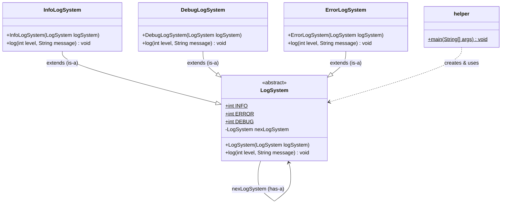
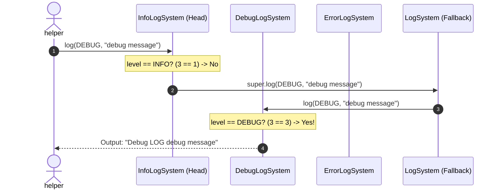
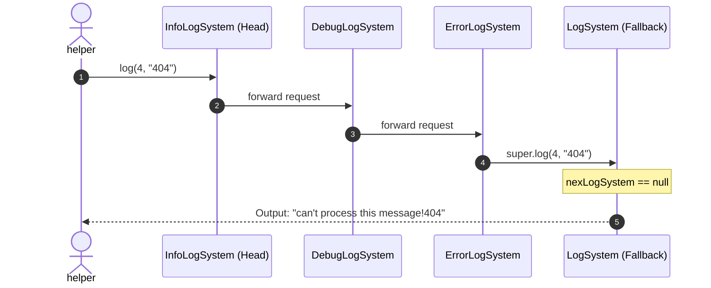

# Low-Level Design (LLD): Logging System using Chain of Responsibility Pattern

## 1. Overview & Problem Statement

In a logging system, incoming log messages have different severity levels (such as `INFO`, `DEBUG`, `ERROR`). 
Without a modular design, the logging logic would typically rely on complex, tightly coupled conditional statements (`if-else` or `switch-case` blocks). Adding new log levels, modifying log behavior, or changing processing priority would require modifying core classes and violating the **Open/Closed Principle (OCP)** and **Single Responsibility Principle (SRP)**.

### Solution: Chain of Responsibility (CoR)
The **Chain of Responsibility** is a behavioral design pattern that lets you pass requests along a chain of handlers. Upon receiving a request, each handler decides either to process the request or to pass it to the next handler in the chain.

---

## 2. Core Concepts & Architecture

### Participants:
1. **Handler (Abstract Handler - `LogSystem`)**:
   - Defines the interface/contract for handling requests (`log(int level, String message)`).
   - Holds a reference to the `nexLogSystem` (successor in the chain).
   - Provides default fallback behavior when a request reaches the end of the chain without being handled.
2. **Concrete Handlers (`InfoLogSystem`, `DebugLogSystem`, `ErrorLogSystem`)**:
   - Extends `LogSystem`.
   - Handles requests for its specific log level.
   - If it cannot handle the request, delegates to `super.log(level, message)`.
3. **Client (`helper`)**:
   - Assembles the chain: `InfoLogSystem -> DebugLogSystem -> ErrorLogSystem -> null`.
   - Initiates log requests on the head of the chain.

---

## 3. UML Class Diagram



---

## 4. Sequence Diagram (Request Flow)

The following diagram illustrates how a `DEBUG` level log request travels through the chain configured as `Info -> Debug -> Error`:



### Unhandled Request Flow (e.g., Level = 4):



---

## 5. Code Structure & Implementation Details

### Chain Setup in `helper.java`
```java
// Chain: InfoLogSystem -> DebugLogSystem -> ErrorLogSystem -> null
LogSystem logSystem = new InfoLogSystem(
    new DebugLogSystem(
        new ErrorLogSystem(null)
    )
);
```

### Execution Trace:
| Call | Level Passed | Message | Handled By | Output |
| :--- | :--- | :--- | :--- | :--- |
| `logSystem.log(3, "debug message")` | `3 (DEBUG)` | `"debug message"` | `DebugLogSystem` | `Debug LOG debug message` |
| `logSystem.log(2, "Error message")` | `2 (ERROR)` | `"Error message"` | `ErrorLogSystem` | `ERROR LOG Error message` |
| `logSystem.log(1, "info message")` | `1 (INFO)` | `"info message"` | `InfoLogSystem` | `INFO LOG info message` |
| `logSystem.log(4, "404")` | `4 (UNKNOWN)` | `"404"` | Fallback in `LogSystem` | `can't process this message!404` |

---

## 6. Design Pattern Analysis

### Strengths & Advantages:
1. **Decoupling**: The sender of a request (`helper`) does not need to know which concrete handler will satisfy it.
2. **Single Responsibility Principle (SRP)**: Each log level handler encapsulates its own formatting and routing logic.
3. **Open/Closed Principle (OCP)**: New loggers (e.g., `WarnLogSystem`, `TraceLogSystem`, `DatabaseLogSystem`) can be added without modifying existing logger classes.
4. **Dynamic Chain Configuration**: Handlers can be added, removed, or reordered dynamically at runtime.

### Trade-offs & Considerations:
- **No Guarantee of Handling**: If the chain is not terminated properly or no handler matches, the request can drop off the end (handled in this design by the base fallback check `nexLogSystem == null`).
- **Performance Overhead**: For very deep chains, traversing multiple nodes adds call-stack overhead.

---

## 7. Real-World Applications

- **Logging Frameworks**: Log4j / SLF4J appenders and level filters.
- **Web Middleware & Interceptors**: Java Servlet Filters (`FilterChain.doFilter()`), Spring `HandlerInterceptor`, Express.js middleware.
- **Security Pipelines**: Spring Security authentication / authorization filter chain.
- **UI Event Bubbling**: DOM event propagation (capturing and bubbling phases in web browsers, Android view touch event handling).
