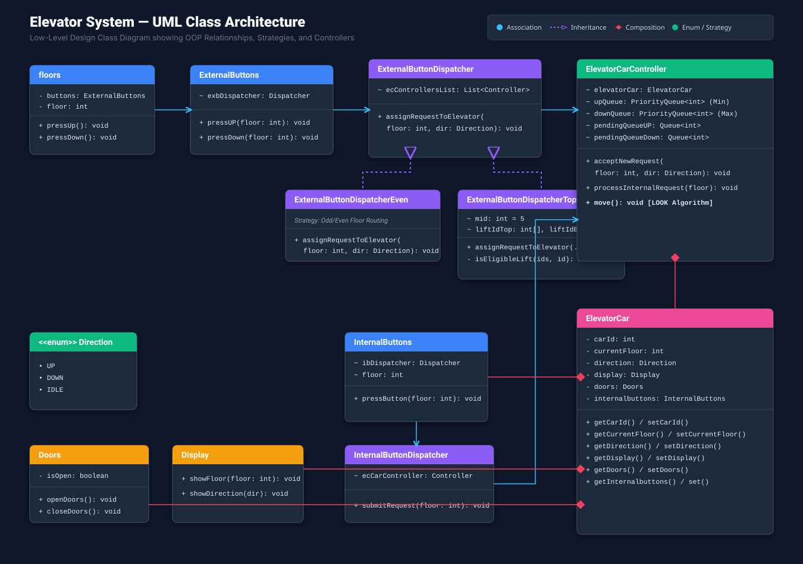
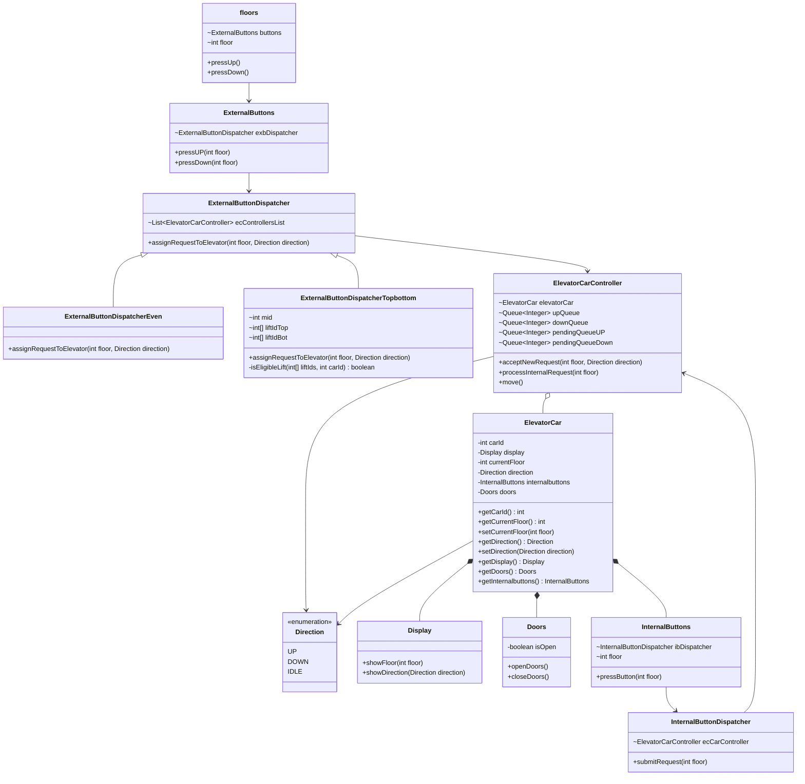
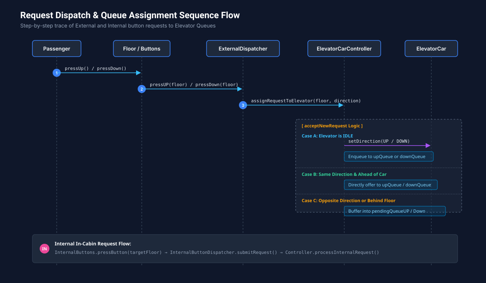
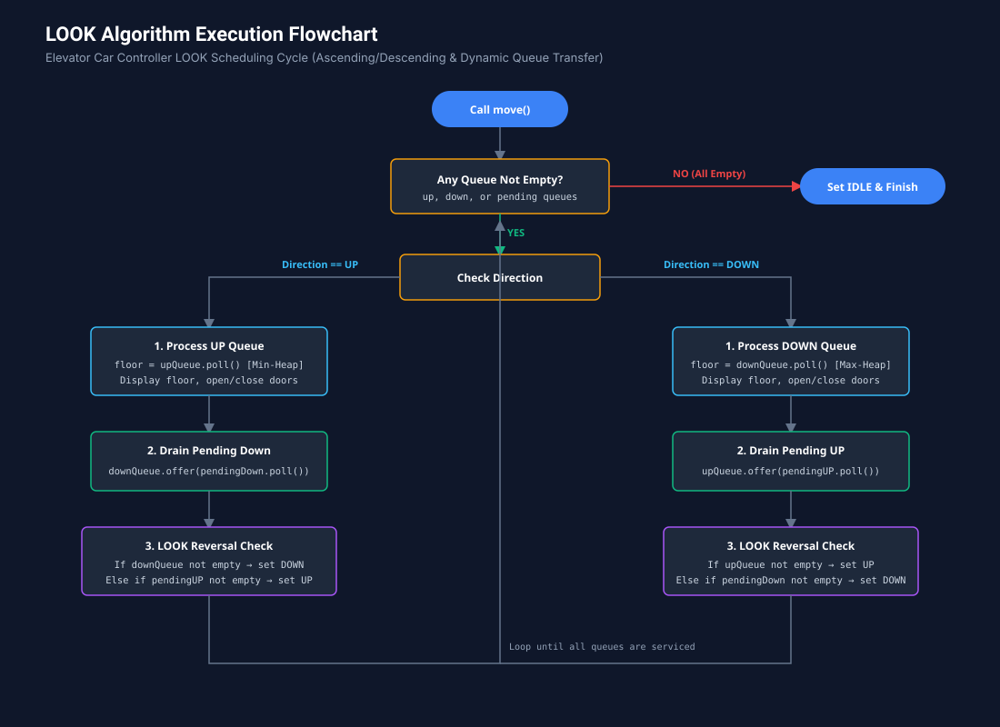

# Elevator System - Low Level Design (LLD)

A robust, object-oriented Low-Level Design (LLD) implementation of a multi-elevator management system in Java, featuring dynamic request dispatching strategies and the **LOOK scheduling algorithm**.

---

## Table of Contents
1. [Key Features](#key-features)
2. [OOPs Concepts & Design Patterns](#oops-concepts--design-patterns)
3. [UML Class Diagram](#uml-class-diagram)
4. [Request Flow Diagrams](#request-flow-diagrams)
5. [Algorithms: LOOK vs SCAN](#algorithms-look-vs-scan)
6. [Component Directory](#component-directory)
7. [Running the Simulation](#running-the-simulation)

---

## Key Features
- **Multi-Elevator Support**: Controls multiple elevator cars independently.
- **Pluggable Dispatch Strategies**:
  - `ExternalButtonDispatcher`: Default routing to the primary controller.
  - `ExternalButtonDispatcherEven`: Routes requests based on even/odd floor assignment.
  - `ExternalButtonDispatcherTopbottom`: Routes high floors (> 5) to dedicated top elevators and lower floors to bottom elevators.
- **LOOK Scheduling Algorithm**: Minimizes elevator travel distance and starvation using priority queues (`upQueue` min-heap, `downQueue` max-heap, and pending FIFO queues).
- **Internal & External Controls**: Supports floor-based panel buttons and car-internal destination selectors.

---

## OOPs Concepts & Design Patterns

### 1. Object-Oriented Principles (OOPs)
- **Encapsulation**: State fields in `ElevatorCar`, `Doors`, and `Display` are encapsulated with getters and setters.
- **Abstraction**: Internal and external button interfaces abstract the underlying queuing and controller dispatch mechanism from callers.
- **Inheritance**: `ExternalButtonDispatcherEven` and `ExternalButtonDispatcherTopbottom` inherit base controller management from `ExternalButtonDispatcher`.
- **Polymorphism**: `assignRequestToElevator(floor, direction)` is dynamically bound based on the active dispatch strategy.

### 2. Design Patterns Applied
- **Strategy Pattern**: Encapsulates elevator assignment algorithms behind `ExternalButtonDispatcher`, allowing seamless switching between Even/Odd or Top/Bottom dispatchers at runtime without altering floor button implementations.
- **Mediator / Dispatcher Pattern**: `InternalButtonDispatcher` and `ExternalButtonDispatcher` decouple button presses from direct elevator hardware manipulations.
- **State Representation**: Explicit `Direction` (`UP`, `DOWN`, `IDLE`) state models state-dependent request acceptance and queue transitions.

---

## UML Class Diagram



<details>
<summary><b>Click to view Mermaid Diagram Code</b></summary>


</details>

---

## Request Flow Diagrams

### 1. External & Internal Call Flow


---

### 2. Elevator Movement Flow (LOOK Algorithm)


---

## Algorithms: LOOK vs SCAN

### LOOK Algorithm (Implemented)
- **Concept**: The elevator travels in the active direction serving all requests until there are **no further requests in that direction**. Then, it reverses and serves requests in the opposite direction.
- **Advantage**: Avoids wasteful travel to the highest or lowest physical floors of the building when no requests exist beyond the furthest active call.
- **Queues Used**:
  - `upQueue`: Min-Priority Queue (`natural order`) -> stops on lowest floor first going UP.
  - `downQueue`: Max-Priority Queue (`(a, b) -> b - a`) -> stops on highest floor first going DOWN.
  - `pendingQueueUP` / `pendingQueueDown`: FIFO queues for requests in opposite direction or behind the current floor.

### SCAN Algorithm (Elevator Algorithm)
- **Concept**: The elevator travels all the way to the **physical terminal boundary** (top floor or bottom floor) regardless of whether requests exist at the boundary, before reversing.
- **Disadvantage**: Wasted time and energy traveling to boundary floors with zero demand.

### Algorithm Comparison Table

| Metric | FCFS (First-Come First-Served) | SSTF (Shortest Seek Time First) | SCAN (Elevator Algorithm) | LOOK Algorithm (Implemented) |
| :--- | :--- | :--- | :--- | :--- |
| **Starvation Risk** | None | High (distant floors starve) | Low | Low / None |
| **Reversal Point** | Arbitrary | Nearest floor | Physical building ends (Floor 0 / Max Floor) | **Furthest requested floor only** |
| **Efficiency** | Low | Moderate | High | **Optimal for Elevators** |
| **Wasted Travel** | High | Low | Moderate (terminal travel) | **Minimal (reverses at boundary request)** |

---

## Component Directory

| File | Purpose |
| :--- | :--- |
| [`ElevatorCar.java`](ElevatorCar.java) | Entity representing the elevator cabin, current floor, state, doors, and internal panel. |
| [`ElevatorController.java`](ElevatorController.java) | Contains `ElevatorCarController` implementing the LOOK algorithm, priority queues, and request handlers. |
| [`ExternalButtons.java`](ExternalButtons.java) | Contains `ExternalButtons`, base `ExternalButtonDispatcher`, `ExternalButtonDispatcherEven`, and `ExternalButtonDispatcherTopbottom`. |
| [`InternalButtons.java`](InternalButtons.java) | Contains `InternalButtons` and `InternalButtonDispatcher` for in-cabin button presses. |
| [`floors.java`](floors.java) | Floor representation linking hall calls (UP/DOWN) to external button dispatchers. |
| [`Display.java`](Display.java) | Displays current floor and direction enum (`UP`, `DOWN`, `IDLE`). |
| [`Doors.java`](Doors.java) | Controls door opening and closing actions. |
| [`TestElevator.java`](TestElevator.java) | Test suite simulating 2 lifts, 5 floors, and bi-directional test scenarios. |

---

## Running the Simulation

Compile and execute the test runner:

```bash
javac *.java
java TestElevator
```
