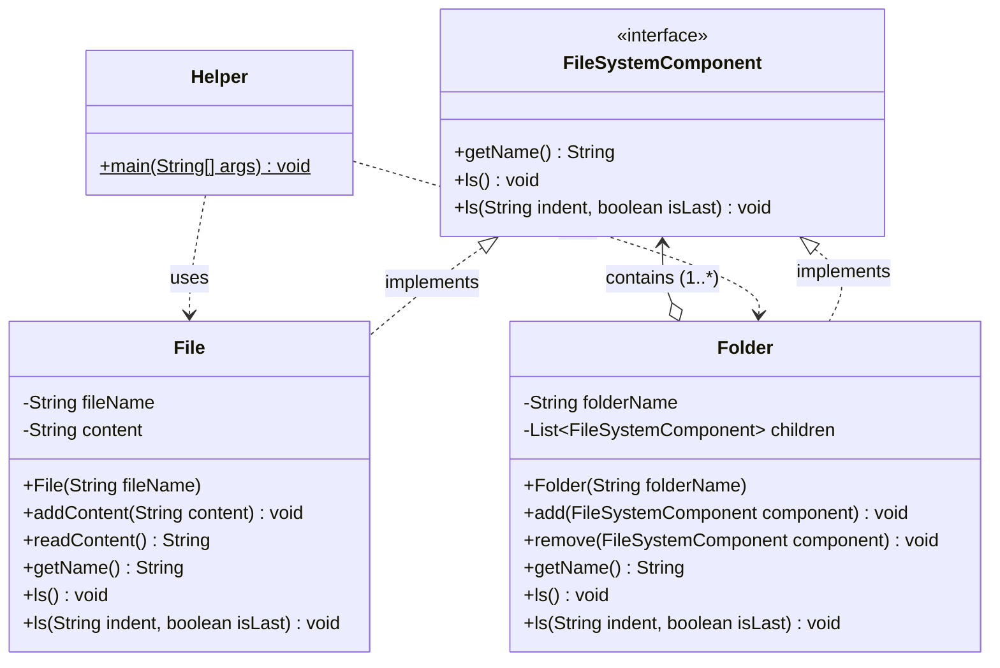

# File System (Composite Design Pattern)

A Low-Level Design (LLD) implementation of a hierarchical File System in Java, demonstrating the **Composite Design Pattern** with tree visualization.

---

## 📐 Class Diagram



---

## 🏗️ Design Pattern Used

### **Composite Pattern (Structural)**

The **Composite Design Pattern** is used to compose objects into tree structures to represent part-whole hierarchies. It allows clients to treat individual objects (files) and compositions of objects (folders) uniformly.

| Role | Class / Interface | Description |
|---|---|---|
| **Component** | [`FileSystemComponent`](FileSystemComponent.java) | Common interface defining contract operations (`getName()`, `ls()`) for both leaf nodes and composites. |
| **Leaf** | [`File`](File.java) | Represents leaf nodes in the tree with no children. Implements display logic for individual files. |
| **Composite** | [`Folder`](Folder.java) | Represents composite containers that hold child `FileSystemComponent` objects (both files and nested folders). Delegates `ls()` operations recursively to its children. |
| **Client** | [`Helper`](Helper.java) | Builds the file hierarchy and triggers operations uniformly through the root component. |

---

## 🔄 Execution & Traversal Flow

1. **Tree Construction**:
   - `Folder root = new Folder("root")`
   - Sub-folders (`documents`, `projects`, `photos`) and `File` objects (`resume.pdf`, `project.txt`, `image.jpg`, `readme.txt`) are instantiated.
   - Folders and files are nested using `folder.add(component)`.

2. **Recursive Tree Printing (`ls()`)**:
   - **Root Level**: Prints the root directory name, followed by vertical spacing `│` before each child node.
   - **Connector Logic**:
     - Intermediate child node: uses `├── ` prefix connector.
     - Last child node: uses `└── ` prefix connector.
   - **Indentation Propagation**:
     - If the current node is an intermediate node, child nodes inherit `"│   "` as their prefix.
     - If the current node is the last node, child nodes inherit `"    "` (4 spaces) as their prefix.

---

## 🚀 How to Run

Compile and execute the program from the project directory:

```bash
# Compile
javac Helper.java

# Run
java Helper
```

---

## 💻 Output

```text
root
│
├── documents
│   ├── resume.pdf
│   └── projects
│       └── project.txt
│
├── photos
│   └── image.jpg
│
└── readme.txt
```
