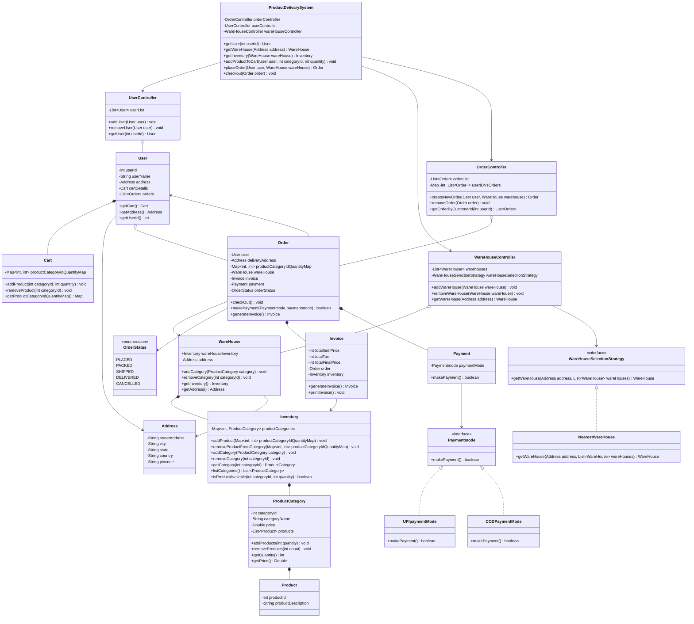
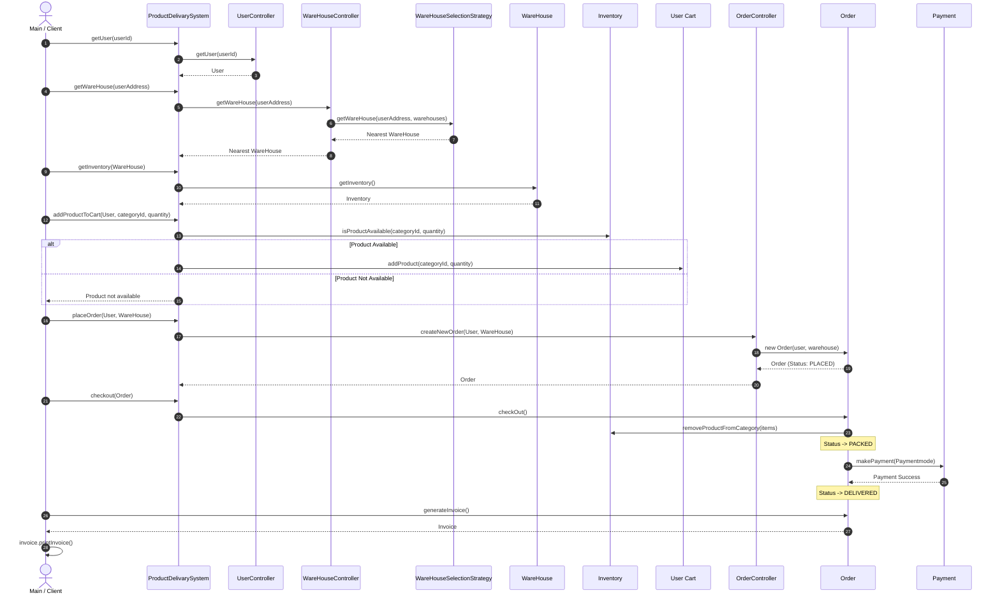

# Inventory Management & Product Delivery System (LLD)

A modular, object-oriented Low-Level Design (LLD) implementation of an **Inventory Management and Product Delivery System** in Java.

---

## 📌 Table of Contents
1. [Overview](#overview)
2. [Design Patterns Used](#design-patterns-used)
3. [Architecture & UML Class Diagram](#architecture--uml-class-diagram)
4. [System Execution Flow](#system-execution-flow)
5. [Project Structure](#project-structure)
6. [Compilation & Execution](#compilation--execution)

---

## 📖 Overview

The system models an end-to-end e-commerce / product delivery workflow with the following capabilities:
* **User Management**: Manages user profiles, delivery addresses, and user shopping carts.
* **Warehouse & Inventory Management**: Manages warehouses across locations, inventories, product categories, and physical product stocks.
* **Warehouse Selection**: Automatically resolves the optimal warehouse to fulfill an order using pluggable selection strategies.
* **Order Processing**: Manages order creation, lifecycle state transitions (`PLACED`, `PACKED`, `SHIPPED`, `DELIVERED`, `CANCELLED`), and automated inventory deduction/rollback.
* **Payment Processing**: Pluggable payment strategies (e.g., UPI, Cash on Delivery).
* **Invoice Generation**: Computes total items price, tax, and final amount.

---

## 🎨 Design Patterns Used

| Design Pattern | Purpose & Implementation |
| :--- | :--- |
| **Facade Pattern** | [`ProductDelivarySystem`](file:///Users/karthiksmacbook/Desktop/SystemDesign/LLD'S/InventoryManagementC/ProductDelivarySystem.java) acts as a unified facade interface that hides the complexity of coordinating multiple subsystems (`UserController`, `WareHouseController`, `OrderController`, `Inventory`). |
| **Strategy Pattern (Warehouse Selection)** | [`WareHouseSelectionStrategy`](file:///Users/karthiksmacbook/Desktop/SystemDesign/LLD'S/InventoryManagementC/Utilities/WareHouseSelectionStrategy.java) interface allows dynamic selection algorithms (e.g., [`NearestWareHouse`](file:///Users/karthiksmacbook/Desktop/SystemDesign/LLD'S/InventoryManagementC/Utilities/NearestWareHouse.java), shortest delivery time, lowest cost) without altering warehouse controller logic. |
| **Strategy Pattern (Payment Mode)** | [`Paymentmode`](file:///Users/karthiksmacbook/Desktop/SystemDesign/LLD'S/InventoryManagementC/Payment/Paymentmode.java) interface enables interchangeable payment implementations like [`UPIpaymentMode`](file:///Users/karthiksmacbook/Desktop/SystemDesign/LLD'S/InventoryManagementC/Payment/UPIpaymentMode.java) and [`CODPaymentMode`](file:///Users/karthiksmacbook/Desktop/SystemDesign/LLD'S/InventoryManagementC/Payment/CODPaymentMode.java). |
| **Controller Pattern** | Domain-specific controllers ([`UserController`](file:///Users/karthiksmacbook/Desktop/SystemDesign/LLD'S/InventoryManagementC/User/UserController.java), [`WareHouseController`](file:///Users/karthiksmacbook/Desktop/SystemDesign/LLD'S/InventoryManagementC/Store/WareHouseController.java), [`OrderController`](file:///Users/karthiksmacbook/Desktop/SystemDesign/LLD'S/InventoryManagementC/User/OrderController.java)) encapsulate business logic and collection state. |

---

## 🏛 Architecture & UML Class Diagram



---

## 🔄 System Execution Flow



---

## 📁 Project Structure

```
.
├── main.java                          # Main entry point & simulation runner
├── ProductDelivarySystem.java         # Facade orchestrating all sub-controllers
├── README.md                          # Architecture, UML & Flow documentation
│
├── Payment/                           # Payment Subsystem (Strategy Pattern)
│   ├── Payment.java                   # Context class for payment
│   ├── Paymentmode.java               # Payment strategy interface
│   ├── UPIpaymentMode.java            # UPI payment implementation
│   └── CODPaymentMode.java            # Cash On Delivery implementation
│
├── Store/                             # Store & Inventory Domain
│   ├── Product.java                   # Product entity
│   ├── ProductCategory.java           # Category managing inventory units & prices
│   ├── Inventory.java                 # Catalog & stock management per warehouse
│   ├── WareHouse.java                 # Physical warehouse representation
│   └── WareHouseController.java       # Controller managing warehouse fleet
│
├── User/                              # User & Order Subsystem
│   ├── User.java                      # User entity
│   ├── UserController.java            # Controller for user operations
│   ├── Cart.java                      # Shopping cart holding selected items
│   ├── Order.java                     # Order aggregate root & state machine
│   ├── OrderController.java           # Controller managing orders
│   ├── OrderStatus.java               # Enum representing order states
│   └── Invoice.java                   # Bill calculation & presentation
│
└── Utilities/                         # Common Utilities & Selection Strategies
    ├── Address.java                   # Address entity
    ├── WareHouseSelectionStrategy.java # Strategy interface for warehouse lookup
    └── NearestWareHouse.java          # Concrete nearest-warehouse strategy
```

---

## 🚀 Compilation & Execution

### 1. Compile All Java Sources
```bash
javac main.java ProductDelivarySystem.java User/*.java Store/*.java Payment/*.java Utilities/*.java
```

### 2. Run the System
```bash
java Main
```

### 3. Expected Output
```text
Category Name: soft drink Price: 100.0Quantity Available:10
Category Name: CAke Price: 20.0Quantity Available:15
Category Name: Chocolate Price: 10.0Quantity Available:20
Product added to cart successfully
UPI payment mode
Total Item Price: 200
Total Tax: 20
Total Final Price: 220
```
