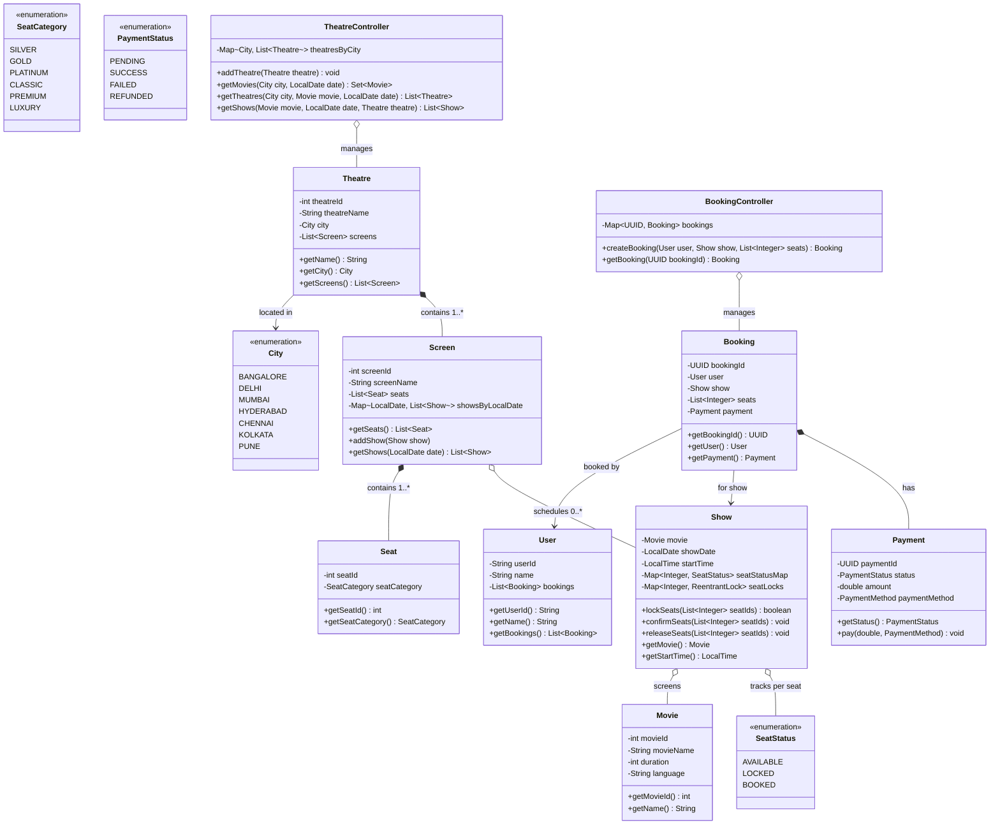
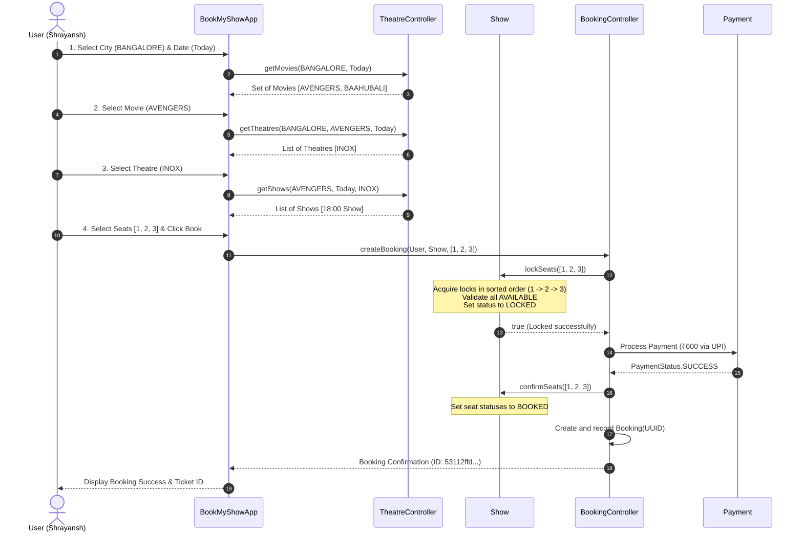

# 🎬 BookMyShow - Low Level Design (LLD)

A robust, thread-safe, and modular **Low-Level Design (LLD)** implementation of a Movie Ticket Booking System (like BookMyShow) in Java.

---

## 📌 1. Requirements

### 1.1 Functional Requirements
1. **City Selection**: Users can select a city (e.g., `BANGALORE`, `DELHI`, `MUMBAI`).
2. **Movie Browsing**: View all movies currently screening in a selected city on a given date.
3. **Theatre & Show Discovery**: View theatres displaying a specific movie in the city, along with show timings.
4. **Seat Selection & Locking**: Users can select multiple seats for a show. Seats are atomically locked to prevent duplicate bookings across concurrent users.
5. **Booking & Payment**: Complete payment for locked seats. On payment success, seats transition to `BOOKED` status and a confirmed `Booking` is issued. If payment fails, locked seats are released back to `AVAILABLE`.

### 1.2 Non-Functional Requirements
- **Thread Safety & High Concurrency**: Prevent race conditions when multiple users attempt to book the exact same seats concurrently.
- **Deadlock Freedom**: Guarantee that concurrent multi-seat reservations never deadlock.
- **Extensibility & Clean Architecture**: Strong adherence to SOLID principles and OOP design patterns.

---

## 🏗️ 2. Core OOP Principles & Design Patterns

| Principle / Pattern | Implementation Details |
| :--- | :--- |
| **Encapsulation** | Internal seat statuses and locks are hidden within `Show`, accessible only via controlled methods (`lockSeats`, `confirmSeats`, `releaseSeats`). |
| **Single Responsibility (SRP)** | Dedicated controllers for domain responsibilities (`TheatreController`, `BookingController`, `MovieController`). |
| **Two-Phase Locking (2PL)** | Fine-grained per-seat `ReentrantLock` instances with global sorting to guarantee atomicity and deadlock prevention. |
| **Type-Safe Enums** | Strongly typed domain states: `City`, `SeatStatus`, `SeatCategory`, `PaymentStatus`, `PaymentMethod`. |

---

## 🔒 3. Concurrency & Deadlock Prevention

When user $A$ selects seats `[1, 2]` and user $B$ selects seats `[2, 1]` simultaneously, uncoordinated locking would lead to a circular wait (Deadlock).

```
User A locks Seat 1 ---> Waits for Seat 2
User B locks Seat 2 ---> Waits for Seat 1 (DEADLOCK!)
```

### 💡 The Solution: Global Lock Ordering
1. **Sorted Lock Acquisition**: All requested seat IDs are sorted in ascending order (`Collections.sort(sorted)`).
2. **Atomic 2-Phase Reservation**:
   - **Phase 1 (Acquire)**: Acquire `ReentrantLock` for each seat in sorted order.
   - **Phase 2 (Validate)**: Check if all requested seats are `AVAILABLE`. If any seat is not available, immediately release acquired locks and return `false`.
   - **Phase 3 (State Change)**: Update all requested seats to `LOCKED`.
   - **Phase 4 (Release in finally)**: Release all acquired locks safely in the `finally` block.

---

## 📊 4. UML Class Diagram



---

## 🔄 5. End-to-End Sequence Flow



---

## 📂 6. Project Structure

```
BookMyShow/
├── BookMyShowApp.java     # Main driver application demonstrating end-to-end flow
├── helper.java            # Helper / test runner class
├── City.java              # City enum (BANGALORE, DELHI, etc.)
├── User.java              # User domain model
├── user.java              # User backward-compatibility wrapper
├── Movie.java             # Movie entity (id, name, duration, language)
├── MovieController.java   # Movie management controller
├── Theatre.java           # Theatre entity (city, screens)
├── TheatreController.java # Discovery & lookup for theatres/shows/movies
├── ThreatreController.java# Legacy alias for TheatreController
├── Screen.java            # Screen model holding seats and scheduled shows
├── Seat.java              # Seat entity with ID and category
├── SeatCategory.java      # Seat tier enum (SILVER, GOLD, PLATINUM, etc.)
├── SeatStatus.java        # Seat state enum (AVAILABLE, LOCKED, BOOKED)
├── Show.java              # Show entity with thread-safe 2PL lockSeats implementation
├── Booking.java           # Booking confirmation record
├── BookingController.java # Booking orchestration & simulated payment execution
├── Payment.java           # Payment entity and payment method/status enums
├── Location.java          # Legacy Location model supporting City integration
└── README.md              # Project documentation and LLD architecture guide
```

---

## 🚀 7. How to Run

Compile and run the project using standard Java tools:

```bash
# Compile all source files
javac *.java

# Run the application
java BookMyShowApp
# or
java helper
```

### Sample Output:
```text
User logged in: Shrayansh
Selected City: BANGALORE
Selected Date: 2026-09-15
Movies available:
 - AVENGERS
 - BAAHUBALI
Selected Movie: AVENGERS
Theatres available:
 - INOX
Selected Theatre: INOX
Shows available:
 - 18:00
Selected Show Time: 18:00
Selected Seats: [1, 2, 3]
BOOKING SUCCESSFUL
Booking ID: b791efe1-52bb-4be0-ab73-f2bf7260f2b8
```
