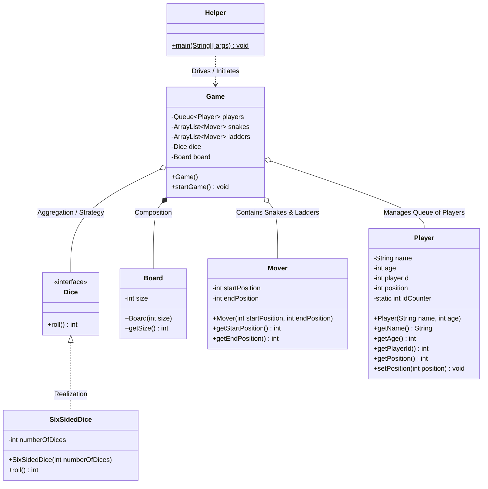
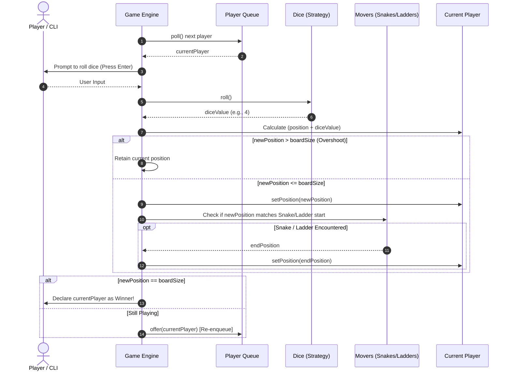

# 🎲 Snake and Ladder - Low Level Design (LLD)

A robust, object-oriented Low-Level Design (LLD) implementation of the classic **Snake and Ladder** board game in Java.

---

## 📋 Table of Contents
1. [Problem Statement & Requirements](#-problem-statement--requirements)
2. [Class Architecture & UML Class Diagram](#-class-architecture--uml-class-diagram)
3. [Game Flow & Sequence Diagram](#-game-flow--sequence-diagram)
4. [Design Patterns & OOP Principles](#-design-patterns--oop-principles)
5. [Core Entities & Responsibilities](#-core-entities--responsibilities)
6. [LLD Deep Dive & Edge Cases](#-lld-deep-dive--edge-cases)
7. [Extensibility & Interview Talking Points](#-extensibility--interview-talking-points)
8. [How to Run the Application](#-how-to-run-the-application)

---

## 🎯 Problem Statement & Requirements

### Functional Requirements
- **Board Configuration**: An $N \times N$ board (default: $10 \times 10 = 100$ cells), numbered from $1$ to $N^2$.
- **Entities**:
  - **Snakes**: Moves player down from a higher cell (head) to a lower cell (tail) (`startPosition > endPosition`).
  - **Ladders**: Moves player up from a lower cell (base) to a higher cell (top) (`startPosition < endPosition`).
- **Dice**: Pluggable dice system (e.g., standard 6-sided dice, single or multiple dice).
- **Players**: Supports 2 or more players taking sequential turns in a round-robin manner.
- **Movement Rules**:
  - A player starts at position `0` (off-board).
  - On their turn, a player rolls the dice and advances by the rolled value.
  - If the new position lands on a Snake head or Ladder bottom, the player immediately jumps to the destination cell.
  - **Overshoot Rule**: If `position + diceValue > boardSize`, the move is invalid and the player stays at their current position.
- **Winning Condition**: The first player to reach the exact final cell ($N^2$) wins the game. The game loop can continue for subsequent rankings or terminate upon the first winner.

---

## 📐 Class Architecture & UML Class Diagram

### Mermaid Class Diagram



---

## 🔄 Game Flow & Sequence Diagram

The diagram below illustrates a single player turn cycle within the game loop:



---

## 💡 Design Patterns & OOP Principles

### 1. Strategy Pattern (`Dice` & `SixSidedDice`)
- **Intent**: Define a family of algorithms, encapsulate each one, and make them interchangeable.
- **Application**: The `Dice` interface decouples the game engine from concrete dice behaviors.
- **Benefit**: We can introduce new dice strategies (e.g., `CrookedDice` that yields only even numbers, `BiasedDice`, or `TwelveSidedDice`) without modifying the `Game` class (**Open-Closed Principle**).

### 2. Generalization / Abstraction (`Mover`)
- **Intent**: Unify common attributes and behaviors into a single concept.
- **Application**: Both **Snakes** (descending) and **Ladders** (ascending) share the same underlying mechanism: a jump from a `startPosition` to an `endPosition`.
- **Benefit**: Eliminates redundant code for `Snake` and `Ladder` classes while maintaining semantic clarity through lists in `Game`.

### 3. Controller / Orchestrator Pattern (`Game`)
- **Intent**: Act as the central coordinator handling game rules, player rotation, input, and state transitions.
- **Application**: `Game` manages references to `Board`, `Dice`, `Mover`, and the `Queue<Player>`.

### 4. SOLID Principles Applied
- **Single Responsibility Principle (SRP)**:
  - `Player`: Manages player state and identity.
  - `Board`: Manages dimensions and cell limits.
  - `Dice`: Responsible solely for number generation.
  - `Mover`: Responsible for transition coordinates.
  - `Game`: Coordinates game flow and rules.
- **Open / Closed Principle (OCP)**: New dice behaviors or board sizes can be plugged in without changing core game logic.
- **Interface Segregation Principle (ISP)**: Minimal `Dice` contract with just `roll()`.
- **Dependency Inversion Principle (DIP)**: `Game` depends on the `Dice` abstraction rather than a concrete `SixSidedDice` class.

---

## 🧱 Core Entities & Responsibilities

| Class / Interface | Responsibility | Key Attributes / Methods |
| :--- | :--- | :--- |
| **`Dice`** *(Interface)* | Contract for rolling dice. | `roll(): int` |
| **`SixSidedDice`** | Generates random numbers between $1$ and $6 \times \text{numberOfDices}$. | `numberOfDices`, `roll()` |
| **`Board`** | Encapsulates board boundaries ($N \times N$). | `size`, `getSize(): int` |
| **`Mover`** | Generic transport entity representing Snake or Ladder jumps. | `startPosition`, `endPosition` |
| **`Player`** | Represents a player, their auto-incremented ID, and current board position. | `playerId`, `name`, `age`, `position` |
| **`Game`** | Orchestrates game initialization, round-robin turns, collision checks, and win conditions. | `players`, `snakes`, `ladders`, `dice`, `board`, `startGame()` |
| **`Helper`** | Entry point for executing the game application. | `main(String[] args)` |

---

## 📝 LLD Deep Dive & Edge Cases

### 1. Turn Management using `Queue<Player>`
- A `LinkedList<Player>` is utilized as a FIFO Queue.
- In each round:
  1. `poll()` removes the player from the front.
  2. The player takes their turn.
  3. If they haven't won, `offer()` pushes them to the back of the queue.
- This ensures **fair $O(1)$ round-robin turn distribution** without manual index manipulation.

### 2. Edge Cases & Handling
- **Overshooting the Finish Line**: If a player is on cell `98` on a 100-cell board and rolls a `4`, moving to `102` is invalid. The move is skipped and the player remains on cell `98`.
- **Chained Snakes and Ladders**: In standard rules, landing on the end of a ladder or snake does not trigger an immediate secondary jump (prevents infinite loops or complex chaining).
- **Snake / Ladder Loop Prevention**: Snakes must have `startPosition > endPosition` and Ladders must have `startPosition < endPosition`. Start positions should never overlap.

---

## 🚀 Extensibility & Interview Talking Points

When presenting or extending this LLD in technical interviews, consider the following enhancements:

1. **$O(1)$ Jump Lookup with `Map<Integer, Integer>` / `Map<Integer, Mover>`**:
   - Currently, snakes and ladders are stored in `ArrayList<Mover>` and checked via linear iteration.
   - *Optimization*: Store jumps in a `HashMap<Integer, Integer>` or cell array for $O(1)$ coordinate resolution:
     ```java
     int nextPos = jumps.getOrDefault(newPosition, newPosition);
     ```

2. **Special Dice Rules**:
   - **Roll of 6**: Grant an additional turn.
   - **Three consecutive 6s**: Cancel current turn movements (penalty rule).

3. **Multi-Winner / Leaderboard Ranking**:
   - Continue the game loop (`while (players.size() > 1)`) and record winning order in a `List<Player> leaderboard` until only one player remains.

4. **Interactive vs Bot Players**:
   - Introduce an abstract `Player` class or `PlayStrategy` to support automated bot players with AI/heuristic roll decisions alongside human players.

5. **Cell-Based Board Model**:
   - Create a `Cell` class containing a `List<Mover>` or optional `Jump` object, converting the board into a graph/grid data structure.

---

## 💻 How to Run the Application

### Prerequisites
- Java Development Kit (JDK 8 or higher installed).

### Compilation & Execution
Navigate to the root directory and run:

```bash
# 1. Compile all Java source files
javac SnakeAndLadder/*.java

# 2. Run the application via Helper
java SnakeAndLadder.Helper
```

### Sample Interactive CLI Run
```text
let's start the game!
Enter number of players:
2
Enter name of player 1:
Alice
Enter age of player 1:
24
Enter name of player 2:
Bob
Enter age of player 2:
26
Lets start the game!
Current Player: Alice's turn to roll dice
Press Enter to roll the dice...

Dice rolled: 5
Player Alice moved to position 5
Player Alice climbed a ladder! Moved to 25
Current Player: Bob's turn to roll dice
Press Enter to roll the dice...

Dice rolled: 3
Player Bob moved to position 3
Player Bob climbed a ladder! Moved to 22
...
Player Alice wins!
```
