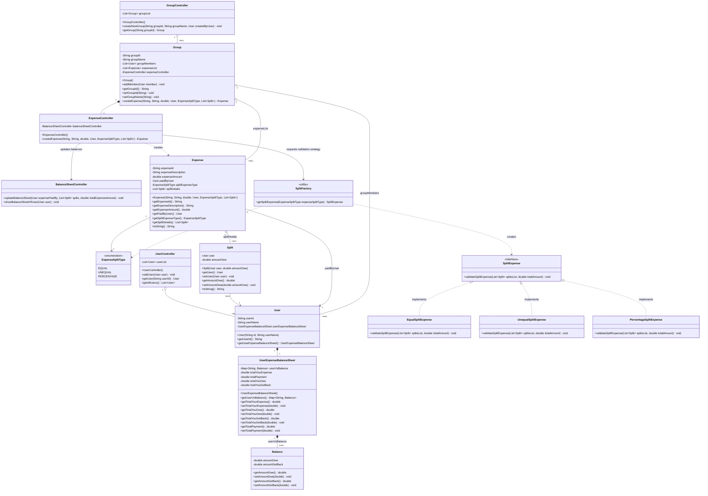
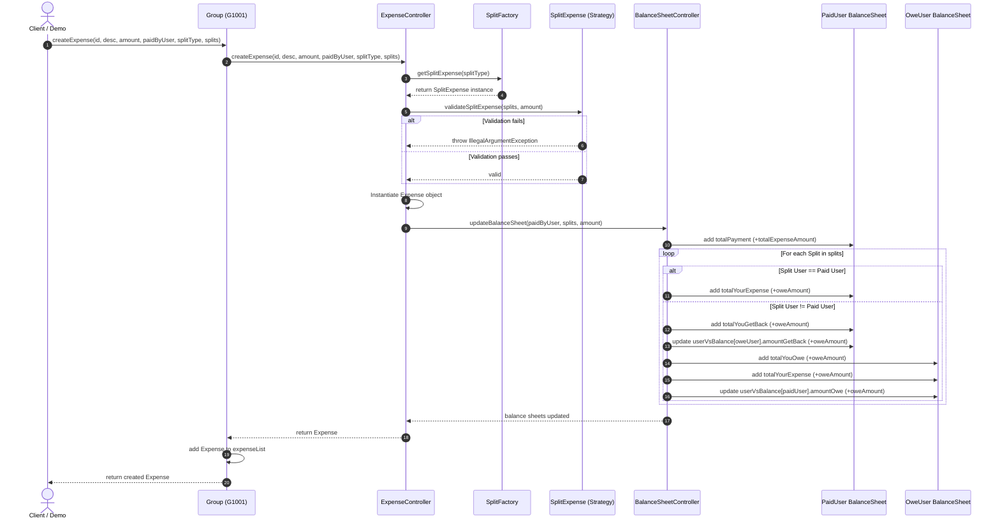

# Splitwise - Low Level Design (LLD) in Java

A modular, extensible Low-Level System Design (LLD) implementation of **Splitwise** in Java. This application manages users, groups, expenses, diverse split strategies, and automated balance sheet accounting.

---

## Table of Contents
1. [System Overview](#system-overview)
2. [Key Features](#key-features)
3. [Design Patterns Used](#design-patterns-used)
4. [UML Class Diagram](#uml-class-diagram)
5. [Workflow & Sequence Diagram](#workflow--sequence-diagram)
6. [Package & Directory Structure](#package--directory-structure)
7. [Component & Package Breakdown](#component--package-breakdown)
8. [Balance Sheet Accounting Logic](#balance-sheet-accounting-logic)
9. [How to Compile and Run](#how-to-compile-and-run)
10. [Sample Output](#sample-output)
11. [Future Enhancements](#future-enhancements)

---

## System Overview

Splitwise is an expense-sharing application that allows users to split expenses with friends and groups. It ensures that every participant knows how much they owe or are owed by others, while maintaining accurate individual balance sheets.

---

## Key Features

- **User Management**: Add and retrieve users, each maintaining an isolated financial balance sheet.
- **Group Management**: Create groups, add members, and manage group-level expenses.
- **Dynamic Split Strategies**:
  - `EQUAL`: Splits the total amount equally among all split members.
  - `UNEQUAL`: Allows custom split amounts for each member.
  - `PERCENTAGE`: Supports percentage-based distribution.
- **Expense Validation**: Validates splits before creating any transaction to ensure mathematical consistency.
- **Automated Balance Sheet Updates**: Real-time updates for:
  - Total payment made by the payer.
  - Total personal expense incurred.
  - Total amount owed to others.
  - Total amount to be collected back.
  - Granular pairwise user-to-user balances (`amountOwe` vs `amountGetBack`).

---

## Design Patterns Used

| Design Pattern | Implementation in Code | Purpose |
| :--- | :--- | :--- |
| **Strategy Pattern** | `SplitExpense` interface implemented by `EqualSplitExpense`, `UnequalSplitExpense`, and `PercentageSplitExpense`. | Encapsulates distinct validation and splitting algorithms so new split types can be added without modifying existing code (Open/Closed Principle). |
| **Factory Pattern** | `SplitFactory` with static `getSplitExpense(ExpenseSplitType)`. | Centralizes and decouples object instantiation of split validation strategies based on the `ExpenseSplitType` enum. |
| **Facade Pattern** | `Splitwise` main orchestration class. | Provides a simplified, high-level interface to initialize, configure, and coordinate subsystems (`UserController`, `GroupController`, `BalanceSheetController`). |
| **Controller / MVC-like Pattern** | `UserController`, `GroupController`, `ExpenseController`, `BalanceSheetController`. | Enforces single-responsibility separation between data models and business operation logic. |

---

## UML Class Diagram



---

## Workflow & Sequence Diagram

The following sequence diagram illustrates the lifecycle of creating an expense inside a group and updating all user balance sheets:



---

## Package & Directory Structure

```text
SplitwiseC/
├── Balance/
│   ├── Balance.java                  # Holds pair-wise amountOwe and amountGetBack
│   └── BalanceSheetController.java   # Updates and displays user balance sheets
├── Expense/
│   ├── Expense.java                  # Expense domain model
│   ├── ExpenseController.java        # Coordinates expense validation, creation & balance updates
│   └── ExpenseSplitType.java         # Enum (EQUAL, UNEQUAL, PERCENTAGE)
├── Group/
│   ├── Group.java                    # Group entity containing members and expenses
│   └── GroupController.java          # Manages collection of groups
├── Split/
│   ├── EqualSplitExpense.java        # Strategy for equal splits
│   ├── PercentageSplitExpense.java   # Strategy for percentage splits
│   ├── Split.java                    # Split entity linking a User and amountOwe
│   ├── SplitExpense.java             # Strategy interface for split validation
│   ├── SplitFactory.java             # Factory to provide appropriate SplitExpense strategy
│   └── UnequalSplitExpense.java      # Strategy for unequal splits
├── User/
│   ├── User.java                     # User entity holding user details and balance sheet
│   ├── UserController.java           # Manages user registration and lookups
│   └── UserExpenseBalanceSheet.java  # Aggregate financial summary of a user
├── Splitwise.java                    # Facade orchestrator & demo scenarios
├── Demo.java                         # Main entry point with public static void main
└── README.md                         # Project documentation
```

---

## Component & Package Breakdown

### 1. `User` Package
- **`User`**: Represents an individual with `userId`, `userName`, and an attached `UserExpenseBalanceSheet`.
- **`UserController`**: Maintains the registry of users (`List<User>`), supporting `addUser`, `getUser(id)`, and `getAllUsers()`.
- **`UserExpenseBalanceSheet`**: Aggregates all monetary figures for a user (`totalYourExpense`, `totalPayment`, `totalYouOwe`, `totalYouGetBack`) and a mapping of specific user balances (`userVsBalance`).

### 2. `Split` Package
- **`Split`**: Pairs a `User` with the specific `amountOwe`.
- **`SplitExpense`**: Strategy interface declaring `validateSplitExpense(List<Split> splitsList, double totalAmount)`.
- **`EqualSplitExpense`**: Ensures each user owes exactly `totalAmount / splitsList.size()`.
- **`UnequalSplitExpense`**: Ensures $\sum(\text{split amounts}) = \text{totalAmount}$.
- **`PercentageSplitExpense`**: Validates percentage shares summing to the total.
- **`SplitFactory`**: Selects and returns the concrete `SplitExpense` based on `ExpenseSplitType`.

### 3. `Expense` Package
- **`Expense`**: Encapsulates expense attributes (ID, description, total amount, payer, split type, and list of splits).
- **`ExpenseSplitType`**: Enum containing `EQUAL`, `UNEQUAL`, and `PERCENTAGE`.
- **`ExpenseController`**: Invokes the strategy factory to validate splits, constructs the `Expense`, and commands `BalanceSheetController` to apply balance updates.

### 4. `Group` Package
- **`Group`**: Holds a list of member users and expenses created within the group. Delegates expense creation to `ExpenseController`.
- **`GroupController`**: Manages multiple groups (`createNewGroup`, `getGroup`).

### 5. `Balance` Package
- **`Balance`**: Encapsulates mutual balance values: `amountOwe` and `amountGetBack`.
- **`BalanceSheetController`**: Executes the accounting logic for both payer and participants upon expense addition, and prints formatted balance sheets.

---

## Balance Sheet Accounting Logic

When User $A$ pays $T$ for an expense with splits involving Users $U_i$ (where each owes $S_i$ and $\sum S_i = T$):

1. **For the Payer ($A$):**
   - $\text{totalPayment} \mathrel{+}= T$
   - For split where $U_i == A$:
     - $\text{totalYourExpense} \mathrel{+}= S_i$
   - For splits where $U_i \neq A$:
     - $\text{totalYouGetBack} \mathrel{+}= S_i$
     - $\text{userVsBalance}[U_i].\text{amountGetBack} \mathrel{+}= S_i$

2. **For the Non-Paying Participant ($U_i \neq A$):**
   - $\text{totalYouOwe} \mathrel{+}= S_i$
   - $\text{totalYourExpense} \mathrel{+}= S_i$
   - $\text{userVsBalance}[A].\text{amountOwe} \mathrel{+}= S_i$

---

## How to Compile and Run

### Prerequisites
- Java Development Kit (JDK 8 or higher).

### Compilation
From the root directory (`SplitwiseC/`):
```bash
javac Demo.java Splitwise.java Balance/*.java Expense/*.java Group/*.java Split/*.java User/*.java
```

### Execution
```bash
java Demo
```

---

## Sample Output

Running `Demo.java` executes two sample expenses (Breakfast of 900 split equally among U1, U2, U3; Lunch of 500 split unequally between U1 and U2):

```text
---------------------------------------
Balance sheet of user : U1001
TotalYourExpense: 700.0
TotalGetBack: 600.0
TotalYourOwe: 400.0
TotalPaymnetMade: 900.0
userID:U2001 YouGetBack:300.0 YouOwe:400.0
userID:U3001 YouGetBack:300.0 YouOwe:0.0
---------------------------------------
---------------------------------------
Balance sheet of user : U2001
TotalYourExpense: 400.0
TotalGetBack: 400.0
TotalYourOwe: 300.0
TotalPaymnetMade: 500.0
userID:U1001 YouGetBack:400.0 YouOwe:300.0
---------------------------------------
---------------------------------------
Balance sheet of user : U3001
TotalYourExpense: 300.0
TotalGetBack: 0.0
TotalYourOwe: 300.0
TotalPaymnetMade: 0.0
userID:U1001 YouGetBack:0.0 YouOwe:300.0
---------------------------------------
```

---

## Future Enhancements

1. **Simplify Debt Graph**: Implement the Minimum Cash Flow / Graph Algorithm to minimize the total number of pairwise transactions (e.g. if A owes B 10 and B owes C 10 $\rightarrow$ A owes C 10).
2. **Settlement Flow**: Add a `settleDebt(User paidBy, User paidTo, double amount)` method to record direct payments and decrement balances.
3. **Percentage / Share Converter**: Introduce a helper to calculate absolute split amounts given percentage or ratio inputs.
4. **Non-Group Expenses**: Support direct user-to-user expenses without requiring a group container.
5. **Persistence & REST API**: Integrate with an RDBMS/NoSQL database and expose Spring Boot REST endpoints.
