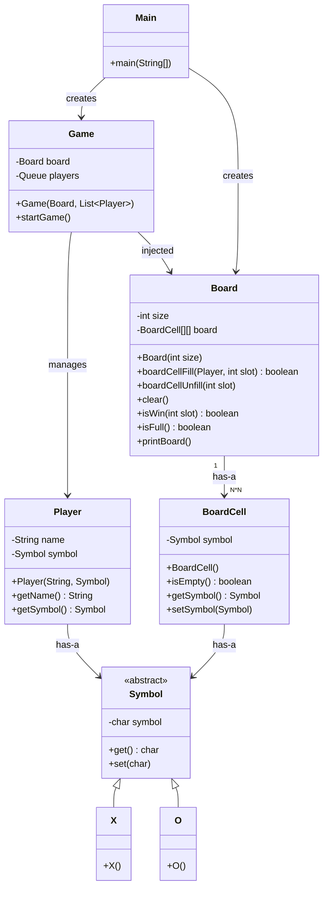

# Tic-Tac-Toe LLD — Complete Game Overview

---

## Project Structure

```
code/
├── Symbol.java       ← Abstract base for game symbols
├── X.java            ← Concrete symbol: X
├── O.java            ← Concrete symbol: O
├── Player.java       ← Represents a player (name + symbol)
├── BoardCell.java    ← A single cell on the board
├── Board.java        ← The game board — all game rules live here
├── Game.java         ← Game loop orchestrator
└── Main.java         ← Entry point
```

---

## Class Diagram



---

## How Each Class Works

### `Symbol.java` — Strategy-like abstraction for game marks
- Abstract class with a `private char symbol`
- `get()` and `set()` provide controlled access
- Subclasses `X` and `O` call `set()` in their constructor
- **Open/Closed**: Adding a new symbol (e.g. `Triangle`) requires only a new subclass — nothing else changes

```java
public abstract class Symbol {
    private char symbol;
    public char get() { return symbol; }
    public void set(char symbol) { this.symbol = symbol; }
}
```

---

### `X.java` / `O.java` — Concrete Symbols
- Each in its own file (one public class per file — Java rule)
- Public constructors, call `set()` to assign their character

```java
public class X extends Symbol { public X() { set('X'); } }
public class O extends Symbol { public O() { set('O'); } }
```

---

### `Player.java` — Immutable player entity
- Holds `name` and `Symbol` — set once at construction, never changed
- No setters — fully immutable after creation
- Public constructor

```java
public class Player {
    private String name;
    private Symbol symbol;
    public Player(String name, Symbol symbol) { ... }
}
```

---

### `BoardCell.java` — A single cell on the grid
- Wraps a `Symbol` reference (null = empty)
- `isEmpty()` cleanly hides the null-check from callers
- Public constructor

```java
public class BoardCell {
    private Symbol symbol;
    public boolean isEmpty() { return symbol == null; }
}
```

---

### `Board.java` — All game rules in one place (SRP ✅)
- Owns the `BoardCell[][]` 2D array
- **Key formula**: `slot → (row, col)` using `row = slot / size`, `col = slot % size`
- `boardCellFill(Player, slot)` — places a symbol, returns false if slot invalid or occupied
- `boardCellUnfill(slot)` — clears a cell (with bounds guard)
- `isWin(slot)` — efficiently checks only the row, column, and diagonals of the last move
- `isFull()` — draw detection
- `printBoard()` — dynamic separator works for any board size

**Win detection flow:**
```
isWin(slot)
  ├─ rowCheck(row, sym)      → all cells in that row match sym?
  ├─ columnCheck(col, sym)   → all cells in that column match sym?
  └─ diagonalCheck(sym)      → main diagonal OR anti-diagonal match sym?
```

---

### `Game.java` — The loop orchestrator (DIP ✅, SRP ✅)
- `Board` is **injected** via constructor — not created internally (Dependency Inversion)
- Players stored in a `Queue<Player>` — `poll()` dequeues the current player, `offer()` re-enqueues after their turn
- `Scanner` created **once** before the loop, closed after — no resource leak
- Null guard on `players.poll()` prevents NPE

**Game loop pseudocode:**
```
Scanner created once
while (win == false):
    player = queue.poll()
    if player == null → break
    show board, ask for slot
    repeat until valid slot placed
    if isWin(slot) → print winner, stop
    if isFull()    → print draw, clear board, stop
    else           → re-enqueue player, continue
Scanner closed
```

---

### `Main.java` — Entry point (DIP ✅)
- Uses `try-with-resources` — Scanner auto-closed even if exception thrown
- Board size entered by user — not hardcoded
- `Board` created first, then **injected** into `Game`

```java
try (Scanner scan = new Scanner(System.in)) {
    int size = Integer.parseInt(scan.nextLine().trim());
    ...
    Board board = new Board(size);
    Game game = new Game(board, playerList);
    game.startGame();
}
```

---

## SOLID Principles — Final Status

| Principle | Status | How |
|---|---|---|
| **S** — Single Responsibility | ✅ | `Board` owns all rules. `Game` owns the loop. `Main` owns wiring. |
| **O** — Open/Closed | ✅ | Add new `Symbol` subclass without touching existing code |
| **L** — Liskov Substitution | ✅ | `X` and `O` are drop-in substitutes for `Symbol` anywhere |
| **I** — Interface Segregation | ✅ | Classes are small and focused; no fat interfaces |
| **D** — Dependency Inversion | ✅ | `Game` receives `Board` via constructor, not via `new Board()` internally |

---

## All Bugs Fixed

| # | File | Bug | Fix Applied |
|---|---|---|---|
| 1 | `Game.java` | `Scanner` created inside loop — resource leak | Moved outside loop, closed after |
| 2 | `Game.java` | `players.poll()` NPE | Added null guard |
| 3 | `Game.java` | `Board` created internally — tight coupling | `Board` injected via constructor |
| 4 | `Board.java` | `boardCellUnfill` no bounds check | Added `if (slot < 0 \|\| slot >= size*size) return` |
| 5 | `Board.java` | `printBoard` separator hardcoded for 3×3 | Changed to `"-".repeat(size * 4 - 1)` |
| 6 | `Board.java` | Redundant negative bounds check | Replaced with `slot < 0 \|\| slot >= size*size` |
| 7 | `Main.java` | `Scanner` not closed | `try-with-resources` |
| 8 | `Main.java` | Board size hardcoded to `3` | User prompted for board size |
| 9 | `Symbol.java` | `symbol` field was `protected` | Made `private`, subclasses use `set()` |
| 10 | `Symbol.java` | `X`, `O` in same file, package-private | Split into `X.java` and `O.java`, `public` |
| 11 | Multiple | All constructors package-private | Made all constructors `public` |

---

## Sample Game Output (3×3)

```
Enter board size (e.g. 3): 3
Enter Player 1 Name: Alice
Enter Player 2 Name: Bob

Alice's turn [X]. Choose a slot (0 to 8):

 0 | 1 | 2 
-----------
 3 | 4 | 5 
-----------
 6 | 7 | 8 

4

Bob's turn [O]. Choose a slot (0 to 8):

 0 | 1 | 2 
-----------
 3 | X | 5 
-----------
 6 | 7 | 8 

0
...

Winner: Alice [X]
```

---

## Object Relationships at Runtime

```
Main
 ├── creates Board(3)
 ├── creates Player("Alice", X)
 ├── creates Player("Bob", O)
 └── creates Game(board, [Alice, Bob])
      ├── Queue: [Alice, Bob]
      └── loop:
           poll Alice → fill slot → isWin? → offer Alice back
           poll Bob   → fill slot → isWin? → offer Bob back
           ...until win or draw
```
