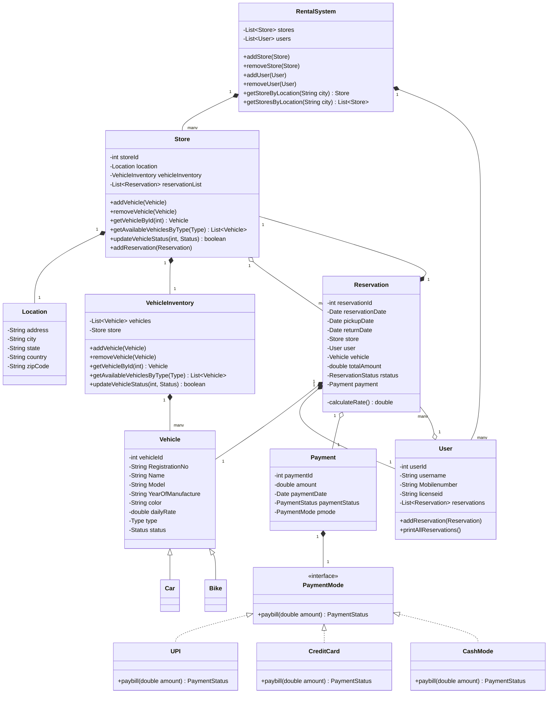
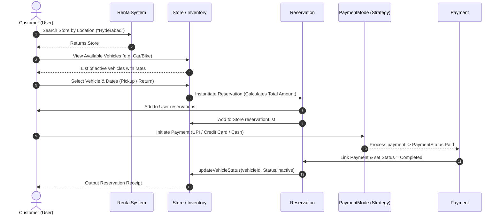

# Vehicle Rental System - Low Level Design (LLD)

A robust, object-oriented Low-Level Design (LLD) implementation of a **Vehicle Rental System** in Java. This system allows users to search for stores by location, browse available vehicles (Cars and Bikes), create reservations with dynamic fare calculation, and complete payments using various payment strategies.

---

## 📌 Table of Contents
- [Vehicle Rental System - Low Level Design (LLD)](#vehicle-rental-system---low-level-design-lld)
  - [📌 Table of Contents](#-table-of-contents)
  - [🎯 Requirements \& Capabilities](#-requirements--capabilities)
  - [📐 Architecture \& Design Patterns](#-architecture--design-patterns)
  - [📊 UML Class Diagram](#-uml-class-diagram)
  - [🔄 Reservation \& Payment Flow](#-reservation--payment-flow)
  - [📁 Project Structure \& Key Classes](#-project-structure--key-classes)
  - [🚀 How to Run](#-how-to-run)
  - [🖥️ Sample Execution Output](#️-sample-execution-output)

---

## 🎯 Requirements & Capabilities

1. **Multi-Store & Multi-Location**:
   - Centralized `RentalSystem` managing multiple stores across cities and locations.
   - Specialized stores (e.g., `CarStore`, `BikeStore`) or general stores with full location details.

2. **Vehicle Inventory Management**:
   - Supports different vehicle types (`Car`, `Bike`) with detailed attributes (registration number, brand, model, daily rate, status).
   - Filter vehicles by type (`Type.Car`, `Type.Bike`), price range, and availability status (`Status.active`, `Status.inactive`).

3. **User Management**:
   - Register users with details like name, contact info, driving license ID, and past reservation history.

4. **Reservation & Pricing**:
   - Create reservations with start date and return date.
   - Automated rental fare computation: $\text{Total Fare} = \text{Duration (days)} \times \text{Daily Rate}$.

5. **Pluggable Payment Processing**:
   - Support for multiple payment modes (**UPI**, **Credit Card**, **Cash**).
   - On successful payment, the reservation status changes to `Completed` and vehicle status is updated to `inactive` (booked).

---

## 📐 Architecture & Design Patterns

- **Strategy Pattern (`PaymentMode`)**:
  - Encapsulates payment algorithms (`UPI`, `CreditCard`, `CashMode`) behind the `PaymentMode` interface. Allows seamless extension for new payment gateways without modifying payment processing logic.
- **Inheritance & Polymorphism**:
  - `Vehicle` $\rightarrow$ `Car`, `Bike`
  - `Store` $\rightarrow$ `CarStore`, `BikeStore`
  - `VehicleInventory` $\rightarrow$ `CarInventory`, `BikeInventory`
- **Separation of Concerns**:
  - Clear domain boundaries between system management, store inventory, user profiles, booking lifecycle, and financial transactions.

---

## 📊 UML Class Diagram



---

## 🔄 Reservation & Payment Flow



---

## 📁 Project Structure & Key Classes

| File | Description |
| :--- | :--- |
| **[`RentalSystem.java`](./RentalSystem.java)** | Root controller managing registered stores and users. Provides lookup by city. |
| **[`Store.java`](./Store.java)** | Represents a physical store with a location, vehicle inventory, and reservations. |
| **[`VehicleInventory.java`](./VehicleInventory.java)** | Manages vehicle catalogue, status transitions, and query filters. |
| **[`Vehicle.java`](./Vehicle.java)** | Base class for vehicles, extended by `Car` and `Bike`. |
| **[`User.java`](./User.java)** | Represents customers with driving license info and booking history. |
| **[`Reservation.java`](./Reservation.java)** | Encapsulates rental duration, dates, vehicle, user, rate calculation, and status. |
| **[`Payment.java`](./Payment.java)** | Stores transaction metadata, status, date, amount, and payment mode used. |
| **[`PaymentMode.java`](./PaymentMode.java)** | Strategy interface for payment methods (`UPI`, `CreditCard`, `CashMode`). |
| **[`Location.java`](./Location.java)** | Address and geographical details for rental stores. |
| **[`enums.java`](./enums.java)** | Defines domain enums: `Type`, `Status`, `ReservationStatus`, `PaymentStatus`. |
| **[`Helper.java`](./Helper.java)** | Main driver / demo script containing helper functions executing end-to-end booking & payment flows. |

---

## 🚀 How to Run

1. **Compile all Java files:**
   ```bash
   javac *.java
   ```

2. **Execute the Helper simulation:**
   ```bash
   java Helper
   ```

---

## 🖥️ Sample Execution Output

```text
========================================================
           VEHICLE RENTAL SYSTEM INITIALIZATION         
========================================================
Vehicle added to inventory: KA12AB1234
Vehicle added to inventory: KA12AB5678
Vehicle added to inventory: KA12AB9012
Vehicle added to inventory: KA12AB3456
Vehicle added to inventory: KA12AB7890
Vehicle added to inventory: KA12CD1111
Vehicle added to inventory: KA12CD2222
Vehicle added to inventory: KA12CD3333
Vehicle added to inventory: KA12CD4444
Vehicle added to inventory: KA12CD5555
User added: 1
User added: 2
Store added: 1
Store added: 2

System setup complete. Stores and users registered.

********************************************************
  FLOW 1: User 1 ('John Doe') Books a Car
********************************************************

Checking available Cars at CarStore (ID: 2):

--- Available Vehicles ---
ID: 6, Reg: KA12CD1111, Name: Creta, Model: Hyundai, Type: Car, Rate: 2500.0
ID: 7, Reg: KA12CD2222, Name: City, Model: Honda, Type: Car, Rate: 2200.0
ID: 8, Reg: KA12CD3333, Name: Thar, Model: Mahindra, Type: Car, Rate: 3000.0
ID: 9, Reg: KA12CD4444, Name: Swift, Model: Maruti, Type: Car, Rate: 1800.0
ID: 10, Reg: KA12CD5555, Name: Nexon, Model: Tata, Type: Car, Rate: 2000.0

----------------- RESERVATION CREATED -----------------
Reservation ID   : 5696
User             : John Doe (ID: 1)
Vehicle          : Creta (Hyundai) [KA12CD1111]
Store Location   : Hyderabad
Pickup Date      : 2026-09-01
Return Date      : 2026-09-04
Daily Rate       : ₹2500.0
Total Amount     : ₹7500.0
Booking Status   : Pending
-------------------------------------------------------

💳 Processing Payment of ₹7500.0 via UPI...
Payment by UPI Mode
Vehicle 6 status updated to: inactive
✅ Payment Successful! Payment ID: 5998
🎉 Reservation #5696 CONFIRMED for John Doe

========================================================
                 RESERVATION RECEIPT                    
========================================================
 Reservation ID   : 5696
 Customer Name    : John Doe
 Mobile / License : +91-9876543210 / DL-HYD-001
 Store            : Store #2 (Hyderabad)
 Vehicle Booked   : Creta - Hyundai [KA12CD1111]
 Vehicle Type     : Car
 Pickup Date      : 2026-09-01
 Return Date      : 2026-09-04
 Total Cost       : ₹7500.0
 Reservation St.  : Completed
 Payment ID       : 5998
 Payment Status   : Paid
 Payment Mode     : UPI
========================================================

********************************************************
  FLOW 2: User 2 ('Jane Smith') Books a Bike
********************************************************

Checking available Bikes at BikeStore (ID: 1):

--- Available Vehicles ---
ID: 1, Reg: KA12AB1234, Name: Dio, Model: Honda, Type: Bike, Rate: 100.0
ID: 2, Reg: KA12AB5678, Name: Activa, Model: Honda, Type: Bike, Rate: 150.0
ID: 3, Reg: KA12AB9012, Name: Jupiter, Model: TVS, Type: Bike, Rate: 200.0
ID: 4, Reg: KA12AB3456, Name: Fascino, Model: Yamaha, Type: Bike, Rate: 250.0
ID: 5, Reg: KA12AB7890, Name: Dio, Model: Honda, Type: Bike, Rate: 100.0

----------------- RESERVATION CREATED -----------------
Reservation ID   : 826
User             : Jane Smith (ID: 2)
Vehicle          : Activa (Honda) [KA12AB5678]
Store Location   : Hyderabad
Pickup Date      : 2026-09-02
Return Date      : 2026-09-06
Daily Rate       : ₹150.0
Total Amount     : ₹600.0
Booking Status   : Pending
-------------------------------------------------------

💳 Processing Payment of ₹600.0 via CreditCard...
Payment by Credit Card Mode
Vehicle 2 status updated to: inactive
✅ Payment Successful! Payment ID: 9695
🎉 Reservation #826 CONFIRMED for Jane Smith

========================================================
                 RESERVATION RECEIPT                    
========================================================
 Reservation ID   : 826
 Customer Name    : Jane Smith
 Mobile / License : +91-9876543211 / DL-HYD-002
 Store            : Store #1 (Hyderabad)
 Vehicle Booked   : Activa - Honda [KA12AB5678]
 Vehicle Type     : Bike
 Pickup Date      : 2026-09-02
 Return Date      : 2026-09-06
 Total Cost       : ₹600.0
 Reservation St.  : Completed
 Payment ID       : 9695
 Payment Status   : Paid
 Payment Mode     : CreditCard
========================================================

********************************************************
  POST-BOOKING VERIFICATION & INVENTORY STATUS
********************************************************

Remaining Available Cars at CarStore (Creta should be removed/inactive):

--- Available Vehicles ---
ID: 7, Reg: KA12CD2222, Name: City, Model: Honda, Type: Car, Rate: 2200.0
ID: 8, Reg: KA12CD3333, Name: Thar, Model: Mahindra, Type: Car, Rate: 3000.0
ID: 9, Reg: KA12CD4444, Name: Swift, Model: Maruti, Type: Car, Rate: 1800.0
ID: 10, Reg: KA12CD5555, Name: Nexon, Model: Tata, Type: Car, Rate: 2000.0

Remaining Available Bikes at BikeStore (Activa should be removed/inactive):

--- Available Vehicles ---
ID: 1, Reg: KA12AB1234, Name: Dio, Model: Honda, Type: Bike, Rate: 100.0
ID: 3, Reg: KA12AB9012, Name: Jupiter, Model: TVS, Type: Bike, Rate: 200.0
ID: 4, Reg: KA12AB3456, Name: Fascino, Model: Yamaha, Type: Bike, Rate: 250.0
ID: 5, Reg: KA12AB7890, Name: Dio, Model: Honda, Type: Bike, Rate: 100.0

--- All Reservations for User John Doe ---
Reservation ID: 5696, Pickup: 2026-09-01, Return: 2026-09-04, Total Amount: 7500.0

--- All Reservations for User Jane Smith ---
Reservation ID: 826, Pickup: 2026-09-02, Return: 2026-09-06, Total Amount: 600.0
```
