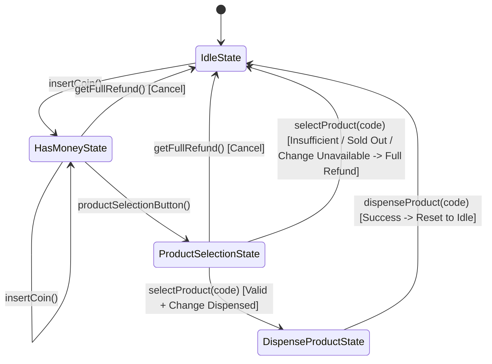

# Vending Machine System Design (LLD)

A robust, production-ready Low-Level Design (LLD) of a **Vending Machine System** in Java using the **State Design Pattern**.

---

## 📌 Features & Requirements

- **State Design Pattern**: Clean transition between machine states (`IdleState`, `HasMoneyState`, `ProductSelectionState`, `DispenseProductState`).
- **Denominations Supported**: Accepts and dispenses coins in `1`, `5`, `10`, and `100` denominations.
- **Inventory & Shelf Management**: Tracks products, codes, and available quantities.
- **Accurate Change Calculation**: Computes exact change using available cash reserves in descending denomination order (100, 10, 5, 1).
- **Auto-Refund & Rollback**: Automatically cancels transaction and returns full payment if:
  - Product is sold out.
  - Insufficient funds are inserted.
  - Vending machine lacks the coins needed to return exact change.
  - User explicitly requests cancellation (`getFullRefund`).

---

## 🏗️ State Machine Diagram



---

## 📂 Project Structure

```
VendingMachine/
├── Coin.java                  # Enum for coin denominations (1, 5, 10, 100)
├── Product.java               # Product entity (name, price)
├── ItemShelf.java             # Shelf entity (code, product, quantity)
├── Inventory.java             # Manages list of item shelves
├── StateInterface.java        # State pattern contract defining all actions
├── IdleState.java             # Initial state waiting for coins
├── HasMoneyState.java         # Accepts additional coins / proceed / cancel
├── ProductSelectionState.java # Handles product validation, change, or refund
├── DispenseProductState.java  # Deducts inventory, deposits coins, and resets
├── VendingMachine.java        # Context class managing state and coin reserves
├── Main.java                  # Test suite covering 6 end-to-end scenarios
└── README.md                  # System documentation
```

---

## 🔄 State Lifecycle & Flow

1. **Idle State (`IdleState`)**:
   - Customer inserts coin $\rightarrow$ machine records coin and transitions to `HasMoneyState`.
2. **Has Money State (`HasMoneyState`)**:
   - Customer can insert additional coins.
   - Customer can press **Product Selection Button** $\rightarrow$ transitions to `ProductSelectionState`.
   - Customer can press **Cancel / Get Full Refund** $\rightarrow$ refunds all inserted coins and resets to `IdleState`.
3. **Product Selection State (`ProductSelectionState`)**:
   - Customer chooses product by code.
   - **Validation Checks**:
     1. Valid product code?
     2. Product in stock?
     3. Inserted money $\ge$ product price?
     4. Can the machine return exact change in `100`, `10`, `5`, `1` coins?
   - If any check fails: transaction is canceled and **full amount is refunded**.
   - If all checks pass: change is dispensed $\rightarrow$ transitions to `DispenseProductState`.
4. **Dispense Product State (`DispenseProductState`)**:
   - Item count in inventory is decremented.
   - Inserted money is deposited into the machine's permanent coin reserve.
   - Product is dispensed to the user tray $\rightarrow$ machine resets to `IdleState`.

---

## 🧪 Scenarios Covered in `Main.java`

| Test Case | Description | Expected Outcome |
|---|---|---|
| **Test 1** | Insert ₹100, select Coca Cola (₹25) | ₹75 change dispensed (`[₹10 x 7, ₹5 x 1]`), item dispensed, resets to Idle. |
| **Test 2** | Insert ₹10 + ₹5, press Cancel | ₹15 refunded, resets to Idle. |
| **Test 3** | Insert ₹10, try to buy ₹20 Pepsi | Insufficient funds error, ₹10 refunded, resets to Idle. |
| **Test 4** | Select out-of-stock product (Snickers) | Sold out error, ₹100 refunded, resets to Idle. |
| **Test 5** | Machine lacks coins for exact change | Change error, ₹100 refunded, resets to Idle. |
| **Test 6** | Exact payment (₹15 for ₹15 Chips) | No change needed, item dispensed, resets to Idle. |

---

## 🚀 How to Run

### Compile all files:
```bash
javac *.java
```

### Run the driver demo:
```bash
java Main
```

---

## 💡 Key Design Highlights (For LLD Interviews)

- **Single Responsibility Principle (SRP)**: Each state class handles only operations valid for its specific phase.
- **Open/Closed Principle (OCP)**: New states (e.g. `MaintenanceState`, `CardPaymentState`) can be added without rewriting existing states.
- **Encapsulation**: State transitions are controlled cleanly via the `VendingMachine` context.
- **Edge Case Resilience**: Defensive checks for coin shortage, inventory exhaustion, and user cancellations.
