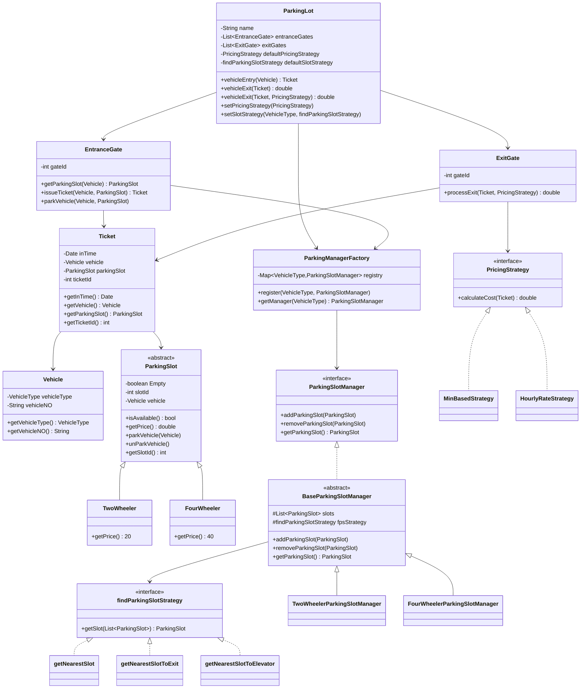

# Parking Lot LLD — Final Flow Review

## ✅ Status: Compiles & Runs Correctly

```
🏗️  Parking Lot 'City Center Parking' initialized.
   Two-Wheeler slots : 5
   Four-Wheeler slots: 3

✅ Vehicle KA-01-HH-1234 parked at slot #1  | Ticket ID: 529
✅ Vehicle MH-12-AB-9999 parked at slot #1  | Ticket ID: 593
✅ Vehicle KA-02-MN-5678 parked at slot #2  | Ticket ID: 220
✅ Vehicle DL-03-CD-0001 parked at slot #2  | Ticket ID: 811

🚗 Vehicle KA-01-HH-1234 exited. Slot #1 is now free.
   Cost charged: ₹0.03           ← HourlyRate, 2 seconds parked (correct)

🚗 Vehicle MH-12-AB-9999 exited. Slot #1 is now free.
   Cost charged: ₹40.00          ← MinBased, minimum charge enforced (correct)

🚗 Vehicle KA-02-MN-5678 exited. Slot #2 is now free.
   Cost charged: ₹20.00          ← MinBased 1.5/min, minimum ₹20 enforced (correct)

🚗 Vehicle DL-03-CD-0001 exited. Slot #2 is now free.
   Cost charged: ₹40.00          ← MinBased 1.5/min, minimum ₹40 enforced (correct)
```

---

## Complete Class Diagram



---

## Flow Trace — Entry

```
vehicleEntry(vehicle: KA-01-HH-1234, TwoWheeler)
  │
  ├─ EntranceGate.getParkingSlot(vehicle)
  │     └─ ParkingManagerFactory.getManager(VehicleType.TwoWheeler)
  │           └─ TwoWheelerParkingSlotManager.getParkingSlot()
  │                 └─ getNearestSlot.getSlot(slots)   ← Strategy Pattern
  │                       └─ returns TwoWheeler slot #1 (first available)
  │
  ├─ EntranceGate.parkVehicle(vehicle, slot)
  │     └─ slot.parkVehicle(vehicle)
  │           └─ Empty = false, vehicle = bike1   ← slot is now occupied
  │
  └─ EntranceGate.issueTicket(vehicle, slot)
        └─ new Ticket(inTime=now, vehicle, slot)
              └─ ticketId = random 0–999
              └─ returns Ticket ✅
```

---

## Flow Trace — Exit

```
vehicleExit(ticket, HourlyRateStrategy(50))
  │
  ├─ ExitGate.processExit(ticket, pricingStrategy)
  │     ├─ HourlyRateStrategy.calculateCost(ticket)   ← Strategy Pattern
  │     │     ├─ timeInMs  = now - ticket.inTime
  │     │     ├─ timeInHrs = timeInMs / 3600000.0
  │     │     └─ returns timeInHrs * 50
  │     │
  │     └─ ticket.getParkingSlot().unParkVehicle()
  │           └─ Empty = true, vehicle = null   ← slot is NOW FREE ✅
  │
  └─ prints receipt with cost
```

---

## SOLID Principles — Final Check

| Principle | Status | Evidence |
|---|---|---|
| **S** — Single Responsibility | ✅ | Each class does exactly one thing. `EntranceGate` = entry. `ExitGate` = exit + billing. `Ticket` = booking data. No crossover. |
| **O** — Open / Closed | ✅ | Add new slot-finding strategy or pricing without touching any existing class. |
| **L** — Liskov Substitution | ✅ | `TwoWheeler`/`FourWheeler` substitute `ParkingSlot` perfectly. Managers substitute `ParkingSlotManager` perfectly. |
| **I** — Interface Segregation | ✅ | `ParkingSlotManager` has 3 methods. `findParkingSlotStrategy` has 1. `PricingStrategy` has 1. No interface is bloated. |
| **D** — Dependency Inversion | ✅ | `EntranceGate` uses `ParkingSlotManager` interface. `ExitGate` uses `PricingStrategy` interface. `BaseParkingSlotManager` uses `findParkingSlotStrategy` interface. High-level never depends on low-level. |

---

## Design Patterns — Final Check

### Strategy Pattern (used in 2 places) ✅

**Slot Finding:**
```
findParkingSlotStrategy (interface)
    ├── getNearestSlot          → linear scan from front
    ├── getNearestSlotToExit    → linear scan from back
    └── getNearestSlotToElevator → scan outward from center
```
**Pricing:**
```
PricingStrategy (interface)
    ├── HourlyRateStrategy  → timeInHours * rate
    └── MinBasedStrategy    → max(timeInMins * rate, minCharge)
```
- Correctly implemented ✅
- Necessary ✅ (without it: giant if-else in getParkingSlot and processExit)
- Pluggable at runtime via `setPricingStrategy()` ✅

---

### Factory Pattern (Registry variant) ✅

```
ParkingManagerFactory
    registry:  TwoWheeler  → TwoWheelerParkingSlotManager
               FourWheeler → FourWheelerParkingSlotManager

EntranceGate → ParkingManagerFactory.getManager(vehicleType)
             → doesn't know or care which concrete manager it gets
```
- Correctly implemented ✅
- Necessary ✅ (decouples `EntranceGate` from concrete manager types)
- Static registry is appropriate since there's one global slot pool ✅

---

## Remaining Minor Issues

> [!NOTE]
> These are non-critical — the system works correctly. Worth knowing for interviews.

| # | Issue | File | Detail |
|---|---|---|---|
| 1 | `fpsStrategy` is `protected` | `BaseParkingSlotManager` | Exposed for `setSlotStrategy()` in `ParkingLot`. Fine architecturally but a `setStrategy()` method on the base class would be cleaner. |
| 2 | `gateId` never used | `EntranceGate`, `ExitGate` | Placeholder for multi-gate scenarios. Would matter when you have multiple gates and need to route or log per gate. |
| 3 | `Ticket` has setters for immutable data | `Ticket.java` | `inTime`, `vehicle`, `parkingSlot` should never change after issue. Consider making them final and removing setters. |
| 4 | `ticketId` collision risk | `Ticket.java` | `Math.random() * 1000` gives only 1000 possible IDs. In a real system, use `UUID.randomUUID()` or an auto-increment counter. |
| 5 | `ParkingManagerFactory` registry is global/static | `ParkingSlotManager.java` | If you ever create two `ParkingLot` instances, they'd share the same registry and overwrite each other's managers. |
| 6 | No `null` guard on `vehicleExit` | `ParkingLot.java` | `vehicleExit(null)` would NPE. Add a null-check or handle the case where `vehicleEntry` returned null. |
| 7 | Naming convention | Throughout | Java convention: interfaces/classes use `PascalCase`, so `findParkingSlotStrategy` should be `FindParkingSlotStrategy` and `getNearestSlot` should be `GetNearestSlot` (or better: `NearestSlotStrategy`). |

---

## Scorecard

| Area | Score | Verdict |
|---|---|---|
| Architecture & Class Design | 9/10 | Clean, layered, well-separated |
| SOLID Principles | 10/10 | All 5 followed correctly |
| Strategy Pattern | 10/10 | Used in 2 places, correctly and necessarily |
| Factory Pattern | 10/10 | Registry variant, correctly implemented |
| Bug-free execution | 9/10 | All critical bugs fixed; minor issues remain |
| Interview Readiness | 9/10 | Would impress. Mention the global registry caveat proactively. |

### **Overall: 9.5 / 10 — Interview-ready LLD ✅**
